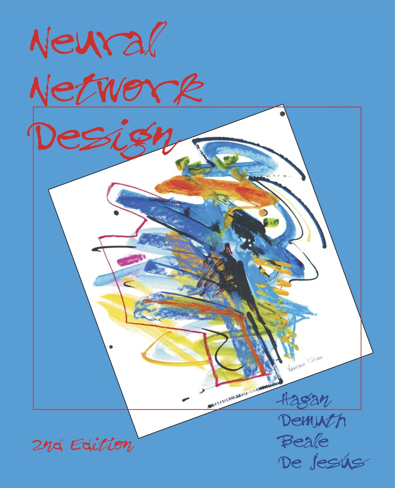
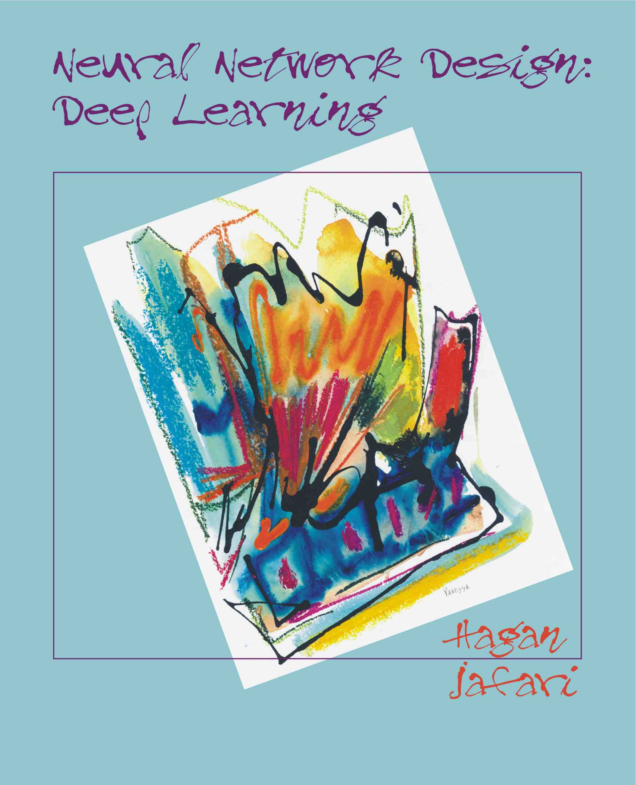

# Neural Network Design Series

The Neural Network Design series consists of two textbooks on neural networks. 
The first covers fundamental concepts, and the second emphasizes topics focused on deep networks. 
The principal idea is to cover the broad area of neural networks using a consistent
notation and terminology. The authors feel that this is especially important in 
a field where contributions have been made over many years and 
have come from researchers across many disciplines. Without a 
common language, it can be difficult to see the commonalities across network
architectures.

Both textbooks contain detailed examples, many solved problems and comprehensive demonstration 
software. In addition, the books' straightforward organization -- with each chapter divided into the 
following sections: Objectives, Theory and Examples, Summary of Results, Solved Problems, Epilogue, 
Further Reading, and Exercises -- makes them excellent tools for independent learning and continued reference.

This site contains a folder for each chapter of each book. Each folder has a Docs subfolder 
containing PDF files of the chapter and associated slides. For chapters covering code, there is a 
also a Code subfolder containing a Jupyter Notebook of the chapter, as well as Jupyter Notebook labs.

## Python Demos
There are interactive Python demonstrations that are integrated 
into most chapters of both books to illustrate important 
concepts. These can be installed using pip. See the associated 
[website](https://pypi.org/project/nndesigndemos/).

<table>
<tr>
<td width="50%" valign="top">

The text **Neural Network Design** provides a clear and detailed survey of 
fundamental neural network architectures 
and learning rules. In it, the authors (Martin Hagan, Howard Demuth, 
Mark Beale, and Orlando DeJesus) emphasize mathematical analysis of
networks, methods for training networks, and applications of networks to 
practical engineering problems in 
pattern recognition, clustering, signal processing, and control systems. 

Foundational background material on linear algebra, optimization and
stability analysis are interspersed with neural network content as needed.
There is extensive coverage of backpropagation, steepest descent, conjugate gradient and 
Levenberg-Marquardt training methods. Both multilayer and recurrent network training are covered 
in detail. The text also covers Bayesian regularization and early stopping training methods, 
which ensure network generalization ability.

Associative and competitive networks, including feature maps and learning vector quantization, 
are explained with simple building blocks.

A chapter of practical training tips for function approximation, pattern recognition, clustering 
and prediction applications is included, along with five chapters presenting detailed real-world 
case studies.

Readability and natural flow of material is emphasized throughout the text.

A hard copy of this text can be ordered from [Amazon](https://www.amazon.com/Neural-Network-Design-Martin-Hagan/dp/0971732116).

</td>
<td width="50%" valign="top">

**Neural Network Design: Deep Learning** is a follow-on to **Neural Network Design**,
authored by Martin Hagan and Amir Jafari, which focuses on concepts especially
relevant to deep neural networks. It reviews multilayer networks and explains 
how deep multilayer networks can be more efficient than wide, but shallow, networks.

The text also has complete chapters on convolution networks, recurrent networks, 
sequence to sequence models, and transformers, among others.

It covers training methods especially suited for deep networks, such as Adam, as well as supplemental
training techniques to improve learning and generalization in deep networks, such as batch normalization
and dropout.

There is a chapter on network explainability, including such techniques as saliency, 
integrated gradient, LRP and DeepLIFT.

The text also covers Python and the popular frameworks, TensorFlow and PyTorch, for 
implementing deep networks.

**Be aware that this text will be continually evolving. 
New chapters will be added, and existing chapters will 
undergo revisions.**

</td>
</tr>
</table>

